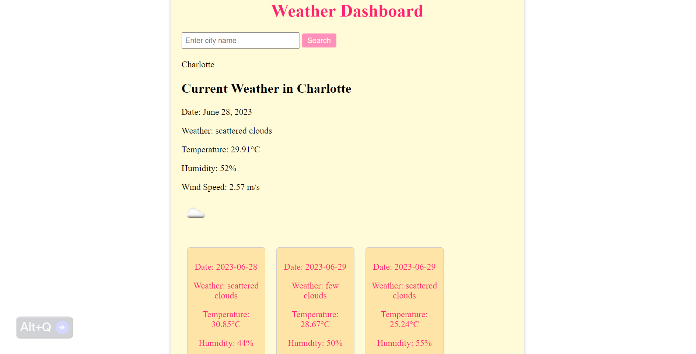

# Funk-E Weather

## Description

I created this applications to make it easy for users to look up the weather from their devices. Many users ponder what the weather will be on a daily basis, so with this app they can see current and future weather forcasts. I learned how to fetch from APIs and use the data to display for users to interact with. 

## Table of Contents

- [Installation](#installation)
- [Usage](#usage)
- [Credits](#credits)
- [License](#license)

## Installation

To use the application users will use the URL to pull up the weather dashboard. They can then enter in a city of their choice and press search. The city will populate the page with the current weather and underneath show the 5 day forcast. 
- Deployed site here --> https://4funke.github.io/weather-dashboard-funk/ 

## Usage

Here is an example of what the page looks like.

## Credits

n/a

## License

This application is covered under the MIT license. 

## Badges

n/a

## Features

n/a

## How to Contribute

n/a

## Tests

n/a

## Questions
  For additional questions, contact me through my [GitHub profile](https://github.com/4FunkE) or via email at 4funkecodes@gmail.com.